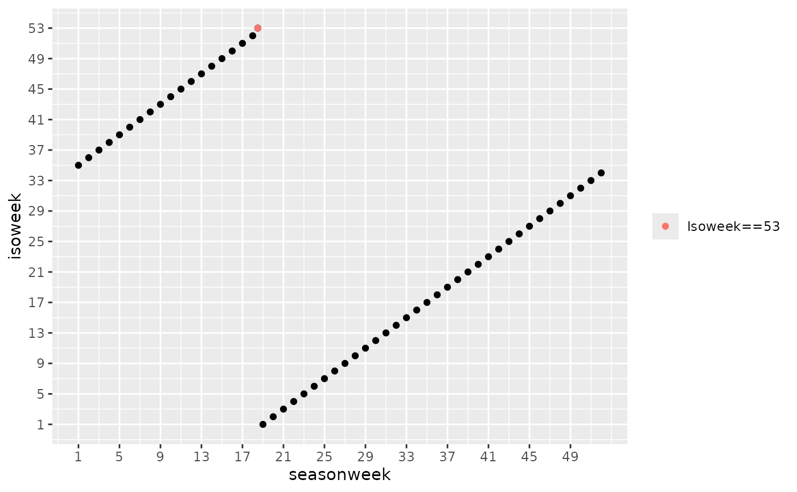

# Season week

Season week is the week number within an epidemiological season. It is
used for surveillance outcomes such as influenza, where aligning data to
a season rather than a calendar year makes trends easier to compare
across years.

Isoweek runs from 1 to 53; season week runs from 1 to 52. When isoweek
is 53, the corresponding season week is 18.5.

``` r
library(cstime)
#> cstime 2025.10.13
#> https://niphr.github.io/cstime/
library(magrittr)
library(data.table)
#> 
#> Attaching package: 'data.table'
#> The following object is masked from 'package:base':
#> 
#>     %notin%
```

## Mapping between isoweek and season week

The chart below shows the relationship across all isoweek values, with
the special case of isoweek 53 highlighted.



## Conversion functions

``` r
seasonweek_to_isoweek_c(10)
#> [1] "44"
seasonweek_to_isoweek_n(10)
#> [1] 44
isoweek_to_seasonweek_n(1)
#> [1] 19
seasonweek_to_isoweek_n(1:52)
#>  [1] 35 36 37 38 39 40 41 42 43 44 45 46 47 48 49 50 51 52  1  2  3  4  5  6  7
#> [26]  8  9 10 11 12 13 14 15 16 17 18 19 20 21 22 23 24 25 26 27 28 29 30 31 32
#> [51] 33 34
isoweek_to_seasonweek_n(1:53)
#>  [1] 19.0 20.0 21.0 22.0 23.0 24.0 25.0 26.0 27.0 28.0 29.0 30.0 31.0 32.0 33.0
#> [16] 34.0 35.0 36.0 37.0 38.0 39.0 40.0 41.0 42.0 43.0 44.0 45.0 46.0 47.0 48.0
#> [31] 49.0 50.0 51.0 52.0  1.0  2.0  3.0  4.0  5.0  6.0  7.0  8.0  9.0 10.0 11.0
#> [46] 12.0 13.0 14.0 15.0 16.0 17.0 18.0 18.5
```
